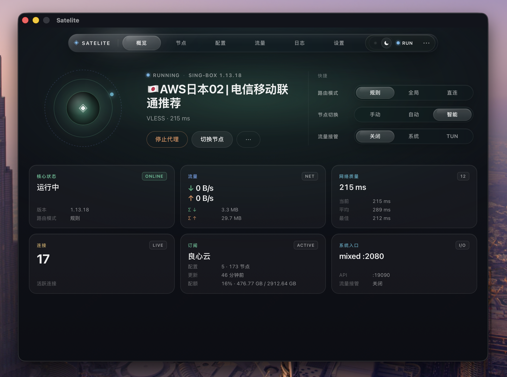

# Satelite Proxy

一个轻量、好看的 **sing-box** 桌面代理客户端，基于 **Tauri 2 + React + Rust** 构建，支持 **macOS** 与 **Windows**。

导入机场订阅、切换节点、规则分流、智能 DNS、系统代理 / TUN，再到托盘常驻，日常使用所需的功能它都有。

<p align="center">
  
</p>

---

## ✨ 主要功能

- **订阅导入**：支持 Clash 兼容订阅，链接导入、文件导入、以及浏览器一键导入（`clash://` / `sing-box://` 深链）
- **节点切换**：支持 SS、VMess、VLESS、Trojan、Hysteria2、TUIC、SOCKS5、AnyTLS、Snell 等 9 种协议，一键测速、快速切换
- **智能选节点**：可选「手动」「应用智能切换（自动避障）」「内核自动测速（urltest）」三种模式
- **规则分流**：基于规则集（Rule Set）的分流，支持远程规则集自动缓存；可按规则 / 全局 / 直连三种模式切换
- **智能 DNS**：支持 DoH、DoT、FakeIP，自定义 DNS 规则与 Hosts，还可测试 DNS 解析
- **系统代理 / TUN**：系统代理一键开启，TUN 模式实现全局透明代理（支持 system / gvisor / mixed 栈）
- **连接与流量监控**：实时查看活跃连接、已关闭连接、失败请求、流量走向，自动解析进程名
- **日志查看**：运行日志与内核日志一目了然
- **托盘常驻**：关闭窗口即最小化到托盘，后台保持连接；支持开机启动、静默启动
- **两种界面风格**：「专业模式」功能齐全，「简洁模式」只留最常用的几项，按需切换
- **内核自动管理**：自动下载并更新 sing-box 内核，无需手动配置
- **多语言与主题**：中文 / 英文，浅色 / 深色主题，多种主题色

## 🖥 平台支持

| 平台            | 状态   |
| --------------- | ------ |
| macOS Apple 芯片 | ✅ 支持 |
| Windows         | ✅ 支持 |
| macOS Intel     | 🚧 计划中 |
| Linux           | 🚧 计划中 |

> Satelite Proxy 仍在持续开发中，升级前请备份重要的配置文件。

## 🛠 技术栈

- **内核**：[sing-box](https://github.com/SagerNet/sing-box)
- **桌面框架**：[Tauri 2](https://tauri.app/)
- **前端**：React + TypeScript + Vite
- **后端**：Rust

## 📦 开发

```bash
# 安装依赖
pnpm install

# 启动开发模式
pnpm tauri dev

# 打包构建
pnpm tauri build
```

## 友情链接

- **佬友聚集地** [linux.do](https://linux.do/)
